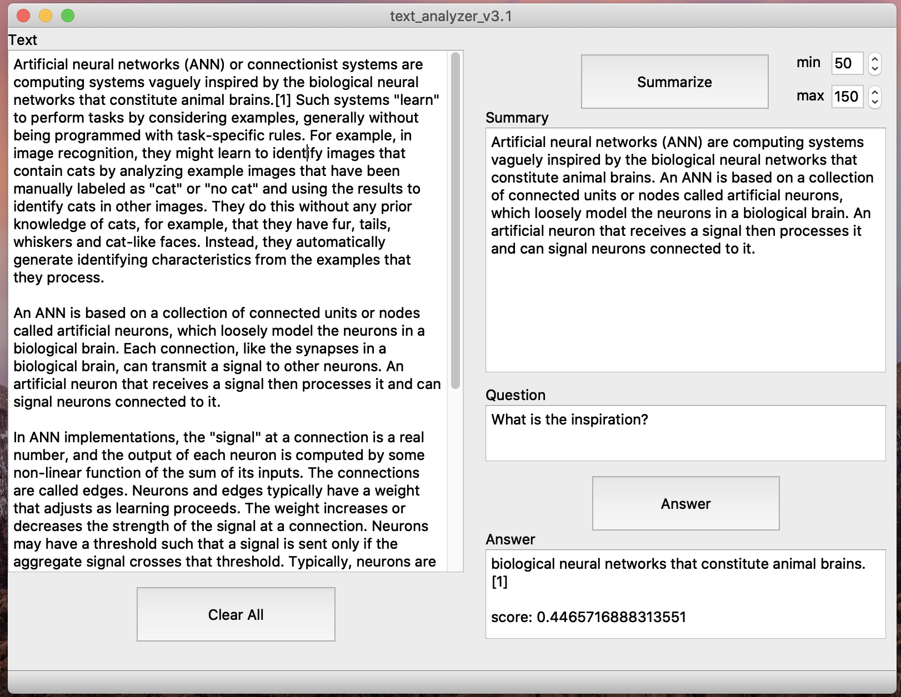

# text_analyzer

## Goal
Develop a program that returns a abstractive summarization for given text, and ables to answer related questions
Purpose: Get familiar with Language modeling tools such as Huggingface, etc.

- Docker container
- Use Huggingface
- Test
- Develop functions
- May develope a UI

## Requirement
- PyQt5
- Transformer (Huggingface)

## Usage
    python3 text_analyzer3-1.py
- copy and paste text
- adjust length of the summary
- get a summary
- type in a question
- get the answer and a confidence score

## User Interface

## Future Work
- When first time clicking "Summarize" and "Answer"; the program when start download OR update the correspond models. And this process is very slow.

- Better UI design

- Embedd with other NLP models
